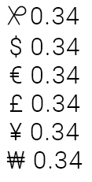

## XRP Symbol

In order for XRP to be perceived as a currency, it needs its own symbol. Just like the dollar sign "$", XRP needs a universal sign that denotes units of XRP. The current logo being used works great when referencing "Ripple" the company, and it **should not be changed**, but a _character_ should be created to represent actual units of the digital asset. Bitcoin for instance, uses the ₿ symbol within an orange circle in an angle, and additional symbols have been suggested for the actual units, eg: ₿, Ƀ or ฿. This repository intends to allow collaboration to create the ubiquitous XRP units symbol that we can use to display the amount of XRP.

Please open a pull request or submit tickets with suggestions.

### Suggested Symbol

The following symbol contains the letters X, R and P hidden within the shape. The symbol also displays the shape of a "drop" or "droplet". A drop is the smallest XRP denomination (1 XRP = 1,000,000 drops). The droplet was positioned in equilibrium, perpendicular to the "top left to bottom right" line on the "X".

 

### Use Case Example

